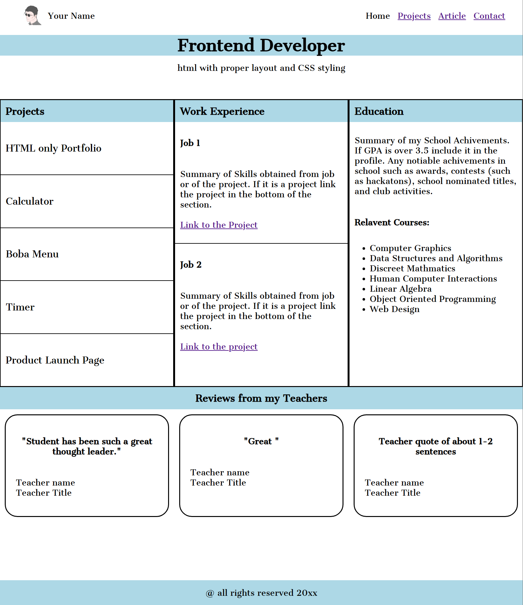
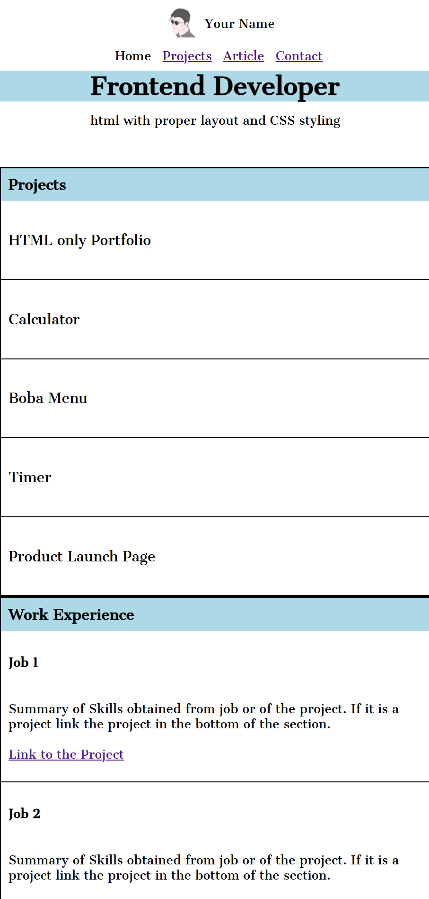
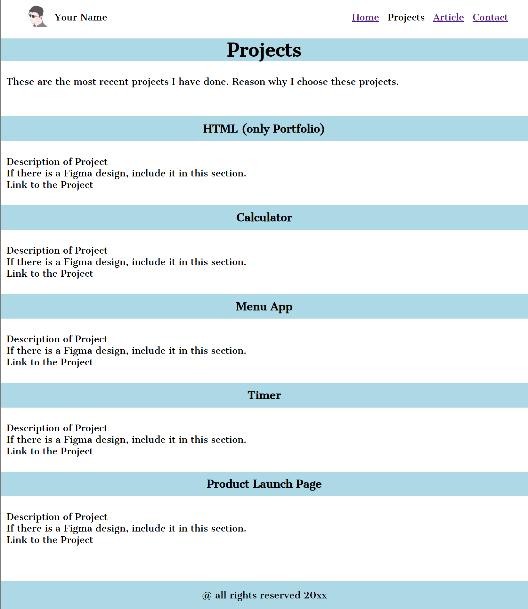

# Personal Portfolio Template
Third project from Roadmap.sh. This is a personal portfolio project that build off the structure of the second project.
[Link to Homepage](Homepage.html)

# Link to Project Instructions on Roadmap.sh
https://roadmap.sh/projects/portfolio-website

# Objective of this Project
For this project, the main objective was on learn how to copy the design of the portfolio from the project instructions on roadmap.sh. This was to learn CSS and how it interacts with HTML. Another object was to make the site responsive.

# Challenges
During this project, I had a hard time trying to style the content side by side. After doing some research, I was still confused with how to get the results I wanted. I used ChatGPT to help me with the CSS of the content. Before I implemented the code, I used W3Schools to double check the CSS.

# Technology Used
VSCode
HTML
CSS

# Screenshots
Homepage Screenshot
    

Mobile Homepage Screenshot
    

Project Page Screenshot
